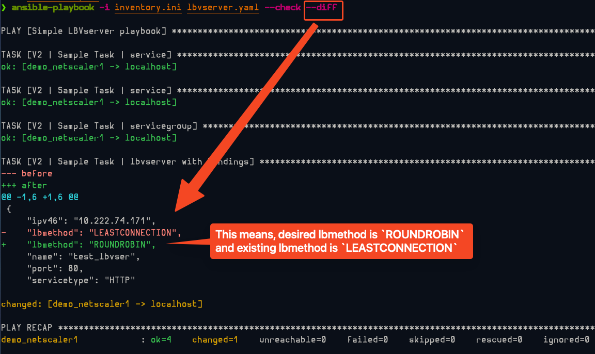
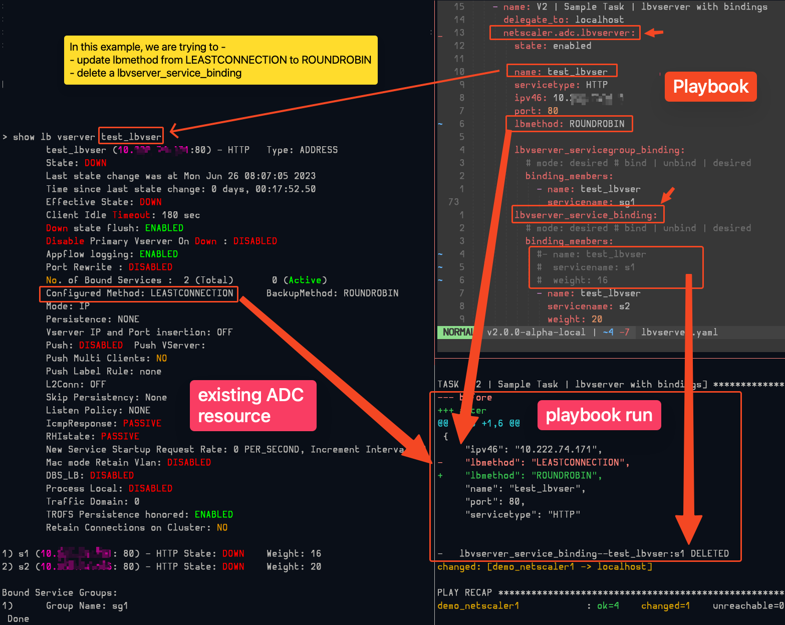
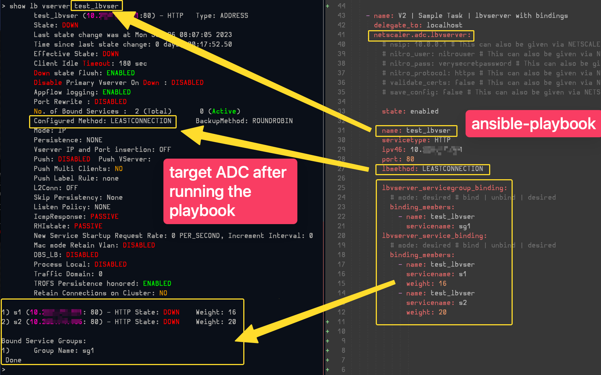
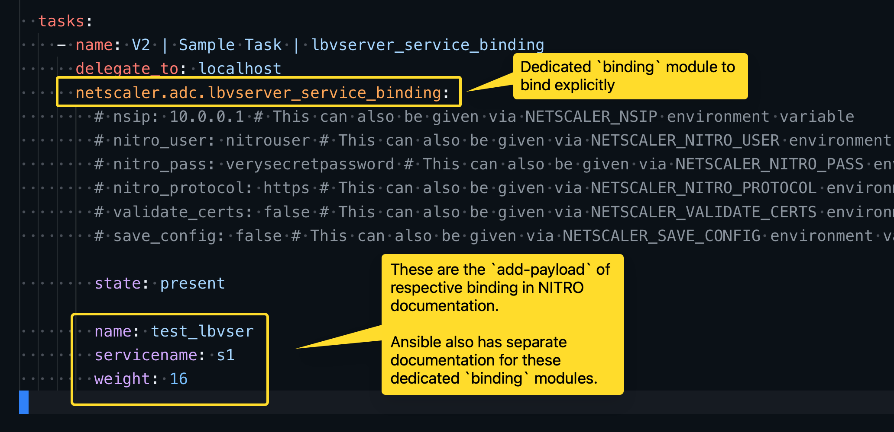

# `netscaler.adc` collection features

## NITRO Python SDK is not required

Unlike the `citrix.adc` collection, the new `netscaler.adc` collection does not require the NITRO Python SDK to be installed on the Ansible control node.

## 4 modes of operation (`state` option in the module task)

The `netscaler.adc` collection supports 4 modes of operation.

| Mode (`state` option) | Description |
| ---- | ----------- |
| `present` | Default. Resource will be created if needed and configured according to the module's parameters |
| `absent` | Resource will be deleted from the target NetScaler ADC nodes |
| `enabled` | Resource will be enalbed on the NetScaler ADC nodes |
| `disabled` | Resource will be disabled on the NetScaler ADC nodes |
| `created` | Resource will be created on the NetScaler ADC nodes |
| `imported` | Resource will be imported on the NetScaler ADC nodes |
| `switched` | TBD: Resource will be switched on the NetScaler ADC nodes. Eg: Partition switch |

> NOTE: The `enabled`, `disabled`, `created`, `imported`, `switched` modes are supported only for the modules that have `enable`, `disable`, `create`, `import`, `switch` operations in the NetScaler ADC NITRO API.

## `--diff` support

> `--diff` mode is not supported for `enabled` and `disabled` states.

<kbd>
    
</kbd>

<kbd>
    
</kbd>

## `--check` support

`--check` mode is support for all the modules.

## In-built bindings support

The `netscaler.adc` collection provides in-built bindings support for all the modules.

In the below example (screenshot), the desired state is to create a `lbvserver` with three bindings

- 2 `service` bindings and
- 1 `servicegroup` binding

Every binding is defined as a separate module option. The available bindings are documented in the module documentation.

> TIP: Usually the name of the built-in bindings ends with `_binding` suffix. Eg: `lbvserver_service_binding`, `lbvserver_servicegroup_binding`, etc.

<kbd>
    
</kbd>

## Explicit bindings support

Apart from the in-built bindings, the `netscaler.adc` collection also supports explicit bindings.

This support will be helpful if the parent resources are already present in the target Netscaler ADC. And the user wants to create a binding between these resources.

<kbd>
    
</kbd>
