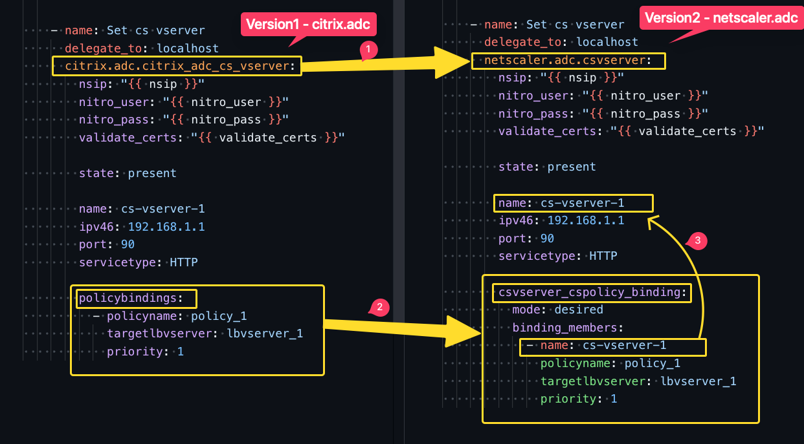

# Migrating from `citrix.adc` collection to `netscaler.adc` collection

1. List of supported modules can be found at [Supported Modules](./supported_modules_matrix.md).
   1. For any non supported modules, please raise an issue at the issue section of the repository.
   2. Meanwhile, you can use the `citrix_adc_nitro_request` and `citrix_adc_nitro_response` modules of the `citrix.adc` collection to perform the operations.

> The below steps are applicable for the supported modules in `netscaler.adc` collection.

> Examples on using `netscaler.adc` collection can be found at [examples](./examples/).

1. Remove `citrix.adc` collection from the system.

    ```bash
    ansible-galaxy collection remove citrix.adc
    ```

2. Install `netscaler.adc` collection.

    TBD

3. Update the playbooks to use `netscaler.adc` collection.

    3.1. If the playbooks are using `citrix.adc` collection, update the playbooks to use `netscaler.adc` collection.

    > It is recommended by Ansible to use fully qualified collection name in the playbooks.

    3.2. If the playbook tasks are using bindings in `citrix.adc`, then update the bindings to use `netscaler.adc` collection bindings.

    The above steps are shown in the following example.

    

